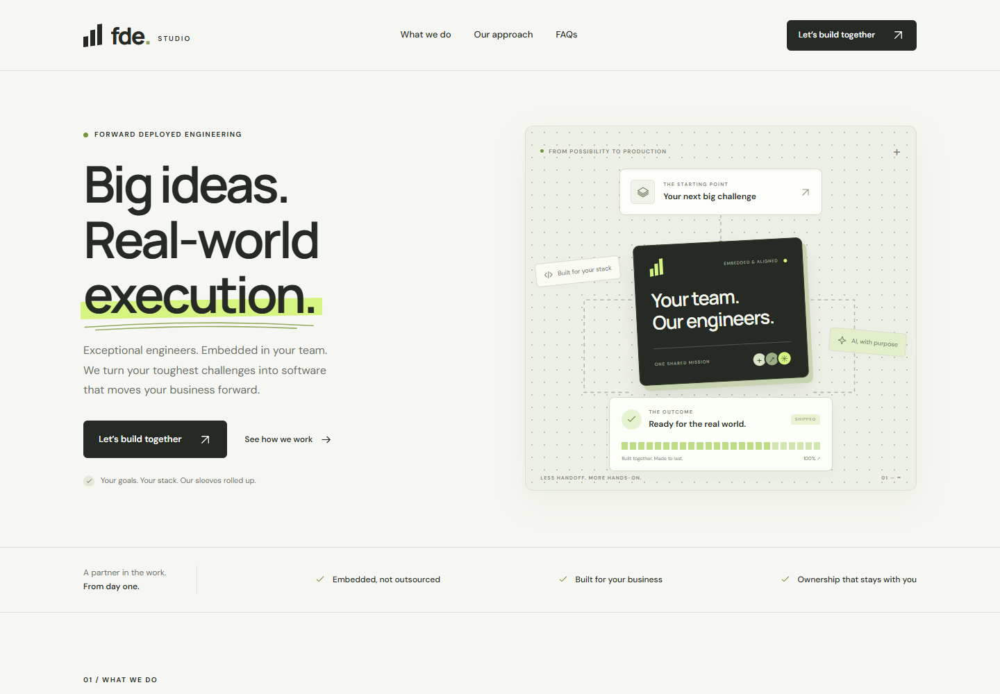
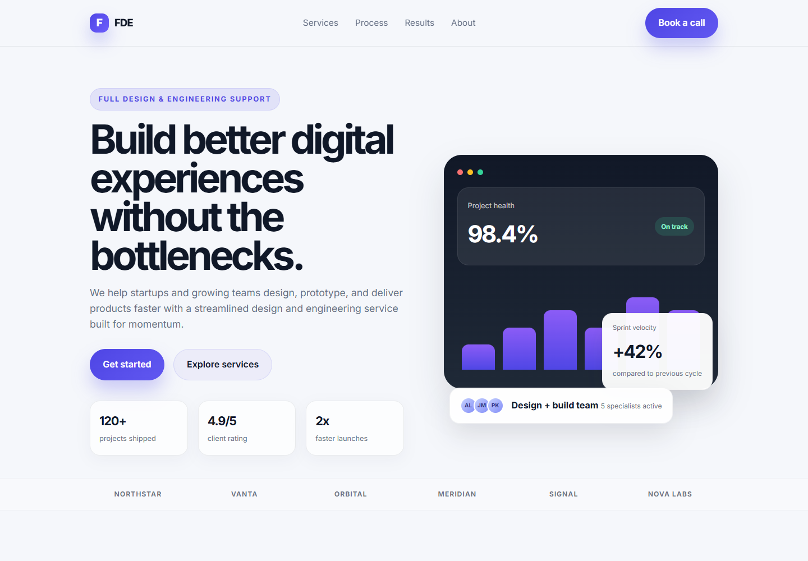

# AI-Assisted Landing Page Development — Observation Report

## 1. AI Models Used

### Model 1

**GPT-6.1 Sol — High**

Project folder: `1. GPT-6.1 Sol - High`

Observed completion time: approximately **10 minutes** for one run.

### Model 2

**MAI-Code-1.1-Flash — 1x**

Project folder: `2. MAI-Code-1.1-Flash • 1x`

Observed completion time: **just under 2 minutes** for one run.

## 2. Prompt Used

> Create a responsive landing page for an FDE service using HTML and CSS.

This prompt was applied to both models so the comparison would be reasonably fair. The most important difference in the outputs below,
**GPT-6.1 Sol** interpreted “FDE” as an embedded engineering service and
**MAI-Code-1.1-Flash** interpreted it as a design and product-delivery service.

## 3. Code Quality Observation

**GPT-6.1 Sol — High:** Produced a more complete FDE landing page with relevant service descriptions, responsive layouts, accessibility features, FAQs, and supporting files. However, compressed HTML and repeated CSS overrides make maintenance harder.

**MAI-Code-1.1-Flash — 1x:** Produced a polished design with simpler, more readable code. However, the content is less specific to FDE, mobile navigation is hidden, and accessibility features are limited.

## 4. AI Hallucination Observation

**GPT-6.1 Sol — High:**: Introduced FDE Studio without confirmation—an unsupported branding assumption.
**MAI-Code-1.1-Flash — 1x:**: Claimed 120+ projects shipped without evidence—an unverified business statistic.

Human verification required for both projects.

## 5. Final Decision

**GPT-6.1 Sol — High produced the better overall result.**

It offered stronger accessibility and functionality, more accurate FDE content, and better understanding of requirements. MAI’s simpler code was easier to maintain, but GPT’s accuracy and completeness outweighed its need for code cleanup.

## Homepage Screenshots

Both screenshots use the same desktop viewport (1440 × 1000).

### GPT-6.1 Sol — High

### MAI-Code-1.1-Flash — 1x

